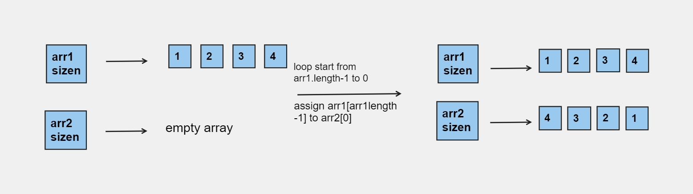

# Array Reverse 


## Whiteboard Process


## Approach & Efficiency
Loop


## Solution

- [Link to code ](/CodeChallenge1/Main.java)
```java 

package CodeChallenge1;

public class Main {
    public static void main(String[] args) {
        int[] arr = { 1, 2, 3, 4, 5, 6 };
        int[] arr2 = reverseArray(arr);
        System.out.print("The Reversed array is:");
        for (int i = 0; i < arr2.length; i++) {
            System.out.print(arr2[i] + " ");
        }
    }

    static int[] reverseArray(int[] array) {
        int[] reverse = new int[array.length];
        int index = 0;
        for (int i = array.length - 1; i >= 0; i--) {
            reverse[index] = array[i];
            index++;
        }
        return reverse;
    }
}
```
