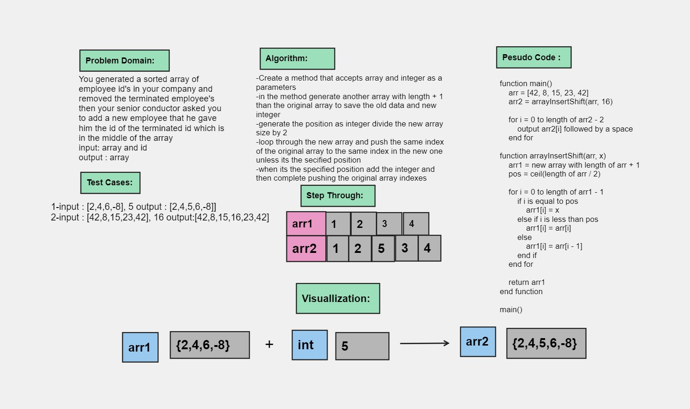

# Array Insert Shift


### Whiteboard Process




### Approach & Efficiency
for Loop

### Solution

- [Link to code ](/CodeChallenge2/Main.java)

```java 

package CodeChallenge2;

public class Main {
    public static void main(String[] args) {
        int[] arr = {42,8,15,23,42};
        int[] arr2 = arrayInsertShift(arr,16);
     
        for (int i = 0; i < arr2.length-1 ; i++) {
            System.out.print(arr2[i] + " ");
        }

    }

static int[] arrayInsertShift(int[] arr, int x){
int[] arr1 =  new int[arr.length+1];
 int pos = (int) Math.ceil(arr.length / 2.0);

    for(int i=0 ;i <=arr1.length-1  ;i++){
        if (i == pos) {
            arr1[i] = x;
        } else if (i < pos) {
            arr1[i] = arr[i];
        } else {
            arr1[i] = arr[i - 1];
        }
    }

    return arr1;
}
}

```
