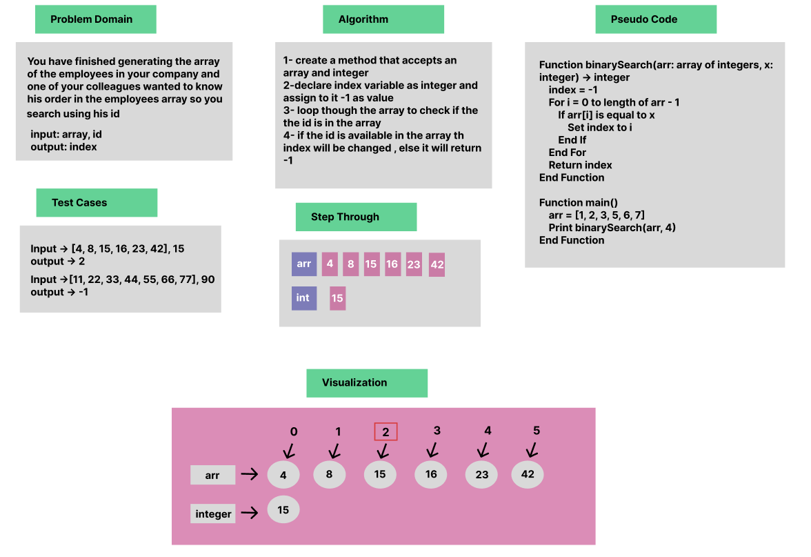

# Array Binary Search


### Whiteboard Process



### Approach & Efficiency
For Loop + If Statement

### Solution

- [Link to code ](/CodeChallenge3/Main.java)

```java 

package CodeChallenge3;

public class Main {
    public static void main(String[] args) {
     
        int arr[] = {1, 2, 3, 5, 6, 7};
        System.out.println(binarySearch(arr, 4));

    }

    static int binarySearch(int arr[],int x){
        int index=-1;
        for(int i=0;i<=arr.length-1;i++){
            if(arr[i] == x)
            index = i;
        }
        return index;

    }
    
}
```
