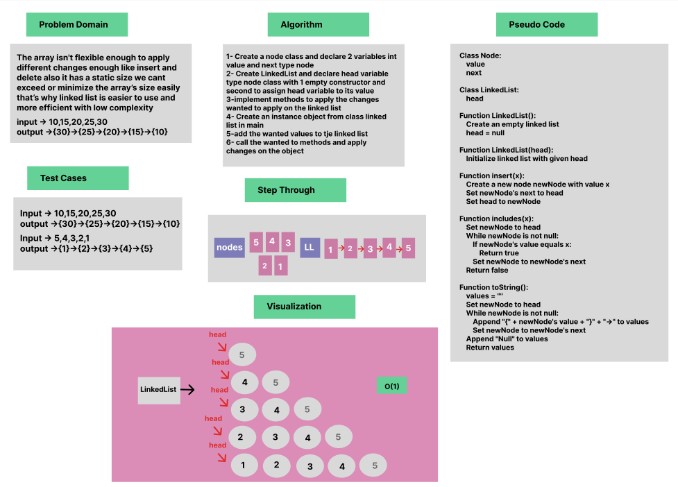

# Linked List Implementation

### Whiteboard Process


### Approach & Efficiency

OOP, While Loop, If statment


### Solution

- [Link to code ](/LinkedList/app/src/main/java/linkedlist/App.java)
```java 
package linkedlist;

public class App {

    public static void main(String[] args) {
        LinkedList list = new LinkedList();
        list.insert(10);
        list.insert(15);
        list.insert(20);
        list.insert(25);
        list.insert(30);

        System.out.println("Linked List " + list.toString());
        System.out.println("Has 15? " + list.includes(15));
        System.out.println("Has 50? " + list.includes(50));
    }
}


public class LinkedList {

Node head;
public LinkedList(){

}
public LinkedList(Node head){
        this.head=head;
    }

    public void insert(int x){
       Node newNode = new Node(x);
       newNode.next=head;
       head=newNode;
    }

    public boolean includes(int x){
        Node newNode= head;
        while(newNode != null){
            if(newNode.value == x)
                return true;
            newNode=newNode.next;
        }
        return false;
    }

    @Override
    public String toString() {
        String values = "";
        Node newNode= head;
        while(newNode != null){
            values+="{" + newNode.value + "}" + "->";
            newNode=newNode.next;
        }
        values+="Null";
        return values;
    }


    public void delete(){
        head=head.next;
    }


}

```
