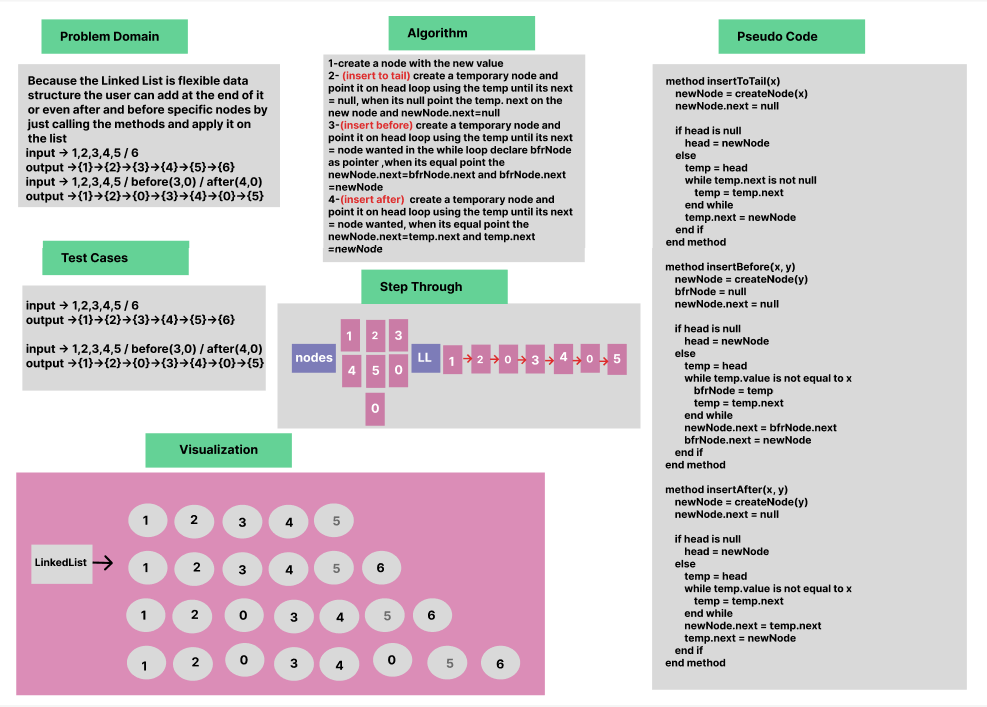

# Linked List Insertions

### Whiteboard Process


### Approach & Efficiency

OOP, While Loop, If statment


### Solution

- [Link to code ](/LinkedList/app/src/main/java/linkedlist/App.java)

```java 
package linkedlist;

public class App {

    public static void main(String[] args) {
       LinkedList list = new LinkedList();
        list.insert(5);
        list.insert(4);
        list.insert(3);
        list.insert(2);
        list.insert(1);
        list.insertToTail(6);

        list.insertAfter(3, 0);
        list.insertBefore(3, 0);


        System.out.println("Linked List " + list.toString());
        System.out.println("Has 15? " + list.includes(15));
        System.out.println("Has 50? " + list.includes(50));
    }
}


public class LinkedList {

public Node head = null;
public Node tail= null;
public LinkedList(){

}
public LinkedList(Node head){
    this.head=head;
    this.tail=tail;
}

    public void insert(int x){
       Node newNode = new Node(x);
       newNode.next=head;
       head=newNode;
    }

    public void insertToTail(int x){
        Node newNode = new Node(x);
        newNode.next=null;
        if(head==null){
            head= newNode;
        }else {
            Node temp=new Node();
            temp=head;
            while(temp.next != null){
                temp=temp.next;
            }
            temp.next=newNode;
        }
    }


    public void insertBefore(int x,int y){
        Node newNode = new Node(y);
        Node bfrNode =null;
        newNode.next=null;
        if(head==null){
            head= newNode;
        }else {
            Node temp=new Node();
            temp=head;
            while(temp.value != x){
                bfrNode=temp;
                temp=temp.next;
            }
    newNode.next=bfrNode.next;
         bfrNode.next=newNode;
        }

    }

    public void insertAfter(int x,int y){

        Node newNode = new Node(y);
        newNode.next=null;
        if(head==null){
            head= newNode;
        }else {
            Node temp=new Node();
            temp=head;
            while(temp.value != x){
                temp=temp.next;
            }
            newNode.next= temp.next;
            temp.next=newNode;

        }
    }

```
