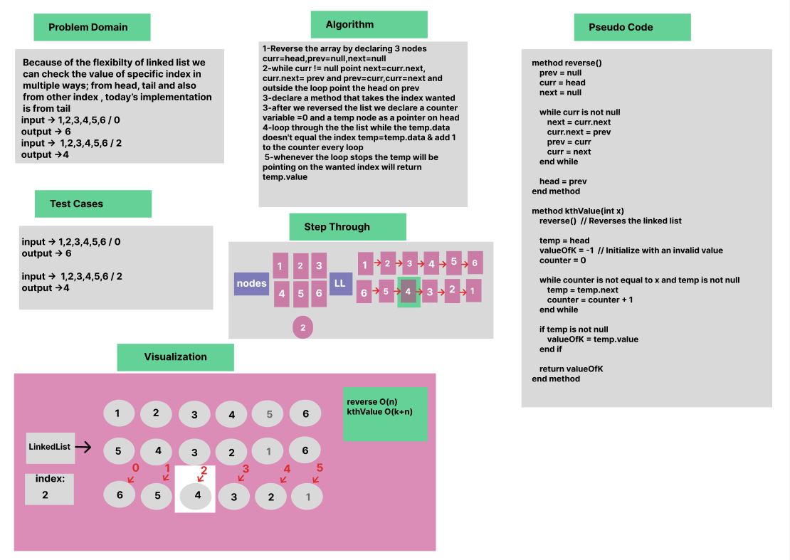

Linked List KthValue

Whiteboard Process



Approach & Efficiency

OOP, While Loop, Reverse Technique

Solution

- [Link to code ](/LinkedList/app/src/main/java/linkedlist/App.java)


````
package linkedlist;

public class App {

    public static void main(String[] args) {
       LinkedList list = new LinkedList();
        list.insert(5);
        list.insert(4);
        list.insert(3);
        list.insert(2);
        list.insert(1);
        list.insertToTail(6);

        list.insertAfter(3, 0);
        list.insertBefore(3, 0);

        System.out.println("Linked List " + list.toString());
        System.out.println("Has 15? " + list.includes(15));
        System.out.println("Has 50? " + list.includes(50));
            System.out.println("k = " + list.kthValue(6));

    }
}

````
````

public class LinkedList {

public Node head = null;
public Node tail= null;

public LinkedList(){ }
public LinkedList(Node head){
this.head=head;
this.tail=tail;
}

 public void reverse(){
        Node prev =null;
        Node curr=head;
        Node next=null;

        while (curr != null){
            next=curr.next;
            curr.next=prev;
            prev=curr;
            curr=next;

        }
        head=prev;

    }
    public int kthValue(int x) {
     reverse();

        Node temp = new Node();
        temp = head;
        int valueOfK; //if the value isn't there return exception not 0
        int counter=0;

        while (counter != x) {
            temp=temp.next;
            counter++;
            }
        valueOfK= temp.value;
        return valueOfK;
        }


    }