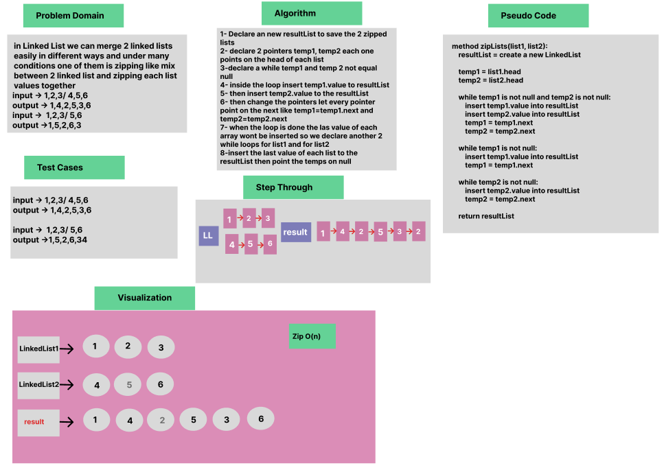

Linked List Zip

Whiteboard Process


Approach & Efficiency

OOP, While Loop

Solution

- [Link to code ](/LinkedList/app/src/main/java/linkedlist/App.java)


````
package linkedlist;

public class App {

    public static void main(String[] args) {
    
        LinkedList list1 = new LinkedList();
        list1.insert(2);
        list1.insert(3);
        list1.insert(1);
        System.out.println("Linked List1 " + list1.toString());

        LinkedList list2 = new LinkedList();
        list2.insert(4);
        list2.insert(9);
        list2.insert(5);
        System.out.println("Linked List2 " + list2.toString());
        
        LinkedList result = list.zipLists(list1, list2);
        System.out.println("Zipped Linked List " + result.toString());
    }
}

````
````

public class LinkedList {

public Node head = null;
public Node tail= null;

public LinkedList(){ }
public LinkedList(Node head){
this.head=head;
this.tail=tail;
}

 public LinkedList zipLists(LinkedList list1,LinkedList list2){

    LinkedList resultList = new LinkedList();

    Node temp1 = list1.head;
    Node temp2 = list2.head;

    while (temp1 != null && temp2 != null) {
        resultList.insertToTail(temp1.value);
        resultList.insertToTail(temp2.value);
        temp1 = temp1.next;
        temp2 = temp2.next;
    }

    while (temp1 != null) {
        resultList.insertToTail(temp1.value);
        temp1 = temp1.next;
    }

    while (temp2 != null) {
        resultList.insertToTail(temp2.value);
        temp2 = temp2.next;
    }

    return resultList;
}

    }